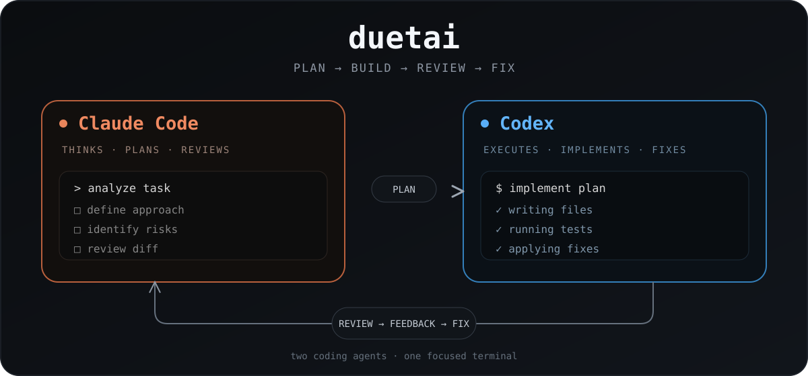

<h1 align="center">DuetAI</h1>

<p align="center">
  <strong>Two coding agents. One focused terminal.</strong>
</p>

<p align="center">
  
</p>

<p align="center">
  <code>Claude plans &amp; reviews</code> → <code>Codex implements &amp; fixes</code>
</p>

DuetAI is a small, local-first terminal orchestrator for running Claude Code and Codex as a disciplined pair. Claude plans and reviews; Codex implements. Both are the official CLIs you already use, so your existing LLM Proxy configuration and credentials stay in place.

## Terminal demo

[▶ Watch the terminal demo (MP4)](assets/duetai-demo.mp4)

The recording shows installation, a deliberately failing test, the Claude → Codex → Claude workflow, and the final green test run.

```text
task → Claude plan → Codex implementation → Claude review → Codex fixes
```

## Install

Requirements: Node.js 20+, Git, an installed `codex` CLI and Claude Code.

```bash
git clone https://github.com/dancher00/duetai.git
cd duetai
npm link
cd /path/to/your/project
duet
```

Or run without installing:

```bash
cd /path/to/your/project
node /path/to/DuetAI/bin/duet.js
```

## Your LLM Proxy setup

DuetAI does not receive or store API keys. It starts the local CLIs as child processes and inherits their environment/configuration.

```bash
export LLMPROXY_API_KEY="your-key"
export ANTHROPIC_API_KEY="your-claude-key"
duet
```

`LLMPROXY_API_KEY` is passed only to Codex. `ANTHROPIC_API_KEY` is passed only to Claude Code. Missing credentials are requested with hidden input; an existing Claude Code `apiKeyHelper` is detected and reused without asking again.

Codex is launched with `codex exec --profile llm-proxy-cu --sandbox workspace-write --json`. Claude Code uses its existing `~/.claude/settings.json` configuration.

## Inside DuetAI

```text
/resume       continue the previous task
/permissions  choose safe, workspace, or full access
/model        choose Claude and Codex models for this session
/exit         quit
```

Running `duet` opens a normal terminal prompt. Enter a task, wait for the pair to finish, then enter the next task. `Esc` cancels the active request (or exits from an idle prompt); `Ctrl-C` exits immediately and stops child agents. DuetAI also works outside a Git repository; Codex is started with its non-repository check disabled in that case.
Type `/` to open command hints; press `Tab` to complete a slash command. `/model` shows selectable Claude and Codex model suggestions and still accepts a custom model name.
If `LLMPROXY_API_KEY` or `ANTHROPIC_API_KEY` is missing, interactive startup asks separately for the Codex and Claude keys using hidden input. The values live only in the DuetAI process: each CLI receives only its own key, and neither key is written to session files. Claude is the lead agent: it answers ordinary conversation itself and explicitly selects `DUET` mode only when Codex implementation and Claude review are useful.

The output shows the useful result of each role: Claude's concrete plan, Codex's implementation decisions and validation, and Claude's review. It does not print internal provider diagnostics or every tool event. Full structured events are saved under `.duet/`.

## Configuration

Configuration is optional. Copy `.duet.example.json` to `.duet.json` only if the project needs custom defaults. Session state and event logs are stored in `.duet/`, which should be ignored by Git.

## Safety

Codex runs with the explicit `workspace-write` sandbox. Claude review runs in `plan` mode. The first version uses one working tree and a sequential workflow to avoid agents overwriting one another. Review the final `git diff` before committing or pushing.

## Development

```bash
npm run check
```

DuetAI is MIT licensed.
